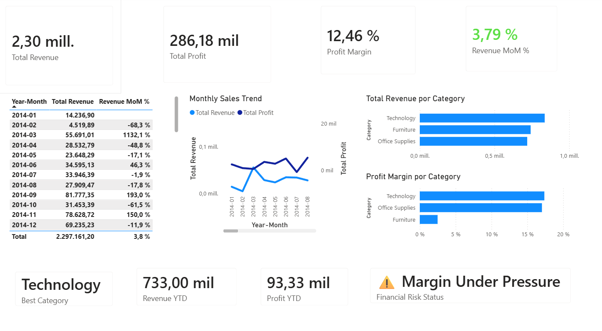
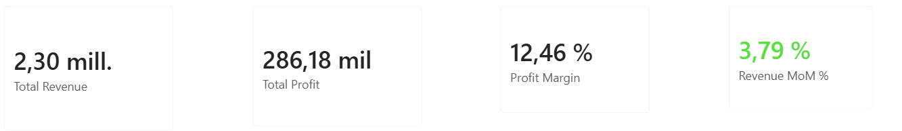
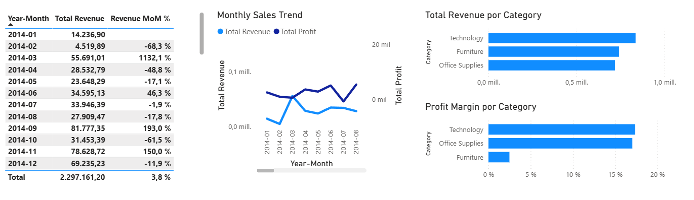

# Financial Performance Dashboard

Interactive financial performance dashboard developed in Power BI to analyze revenue, profitability, margins, growth and category-level performance.

## Business Problem

The objective of this project was to create an interactive dashboard that provides a consolidated view of financial performance and allows the analysis of revenue, profitability, margins and changes over time.

## Objective

Develop a Power BI dashboard to monitor key financial indicators, analyze performance by category and identify changes in revenue and profitability over time.

## Data Preparation

The data was prepared and transformed using Power Query before being analyzed in Power BI.

DAX was used to create calculated measures and financial KPIs for the dashboard.

## Key Performance Indicators

The dashboard includes 8 financial and performance KPIs, including:

- Total Revenue
- Total Profit
- Profit Margin
- Revenue MoM %
- Revenue YTD
- Profit YTD
- Best Category
- Financial Risk Status

## Analysis

The dashboard combines several analytical views:

- Monthly revenue and profit trends
- Month-over-month revenue variation
- Revenue by category
- Profit margin by category
- Year-to-date revenue and profit
- Financial performance monitoring

## Dashboard

### Financial KPIs

### Performance Analysis

## Key Findings

- Technology is identified as the best-performing category by revenue.
- Technology and Office Supplies show substantially higher profit margins than Furniture.
- Revenue performance varies considerably across months, with significant month-over-month changes.
- The dashboard identifies a margin pressure condition through the Financial Risk Status indicator.

## Business Takeaways

The analysis provides a consolidated view of financial performance and highlights areas that require closer monitoring, particularly category-level profitability and changes in revenue over time.

## Tools

- Power BI
- Power Query
- DAX
